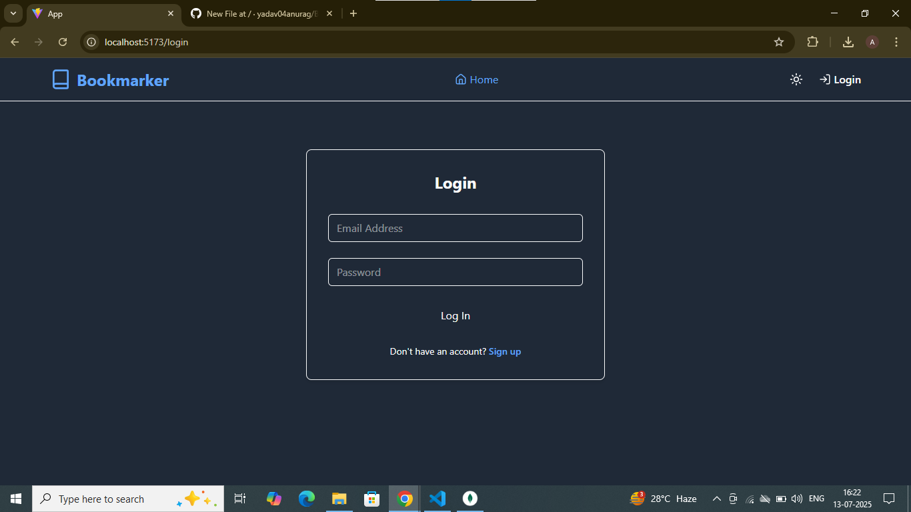
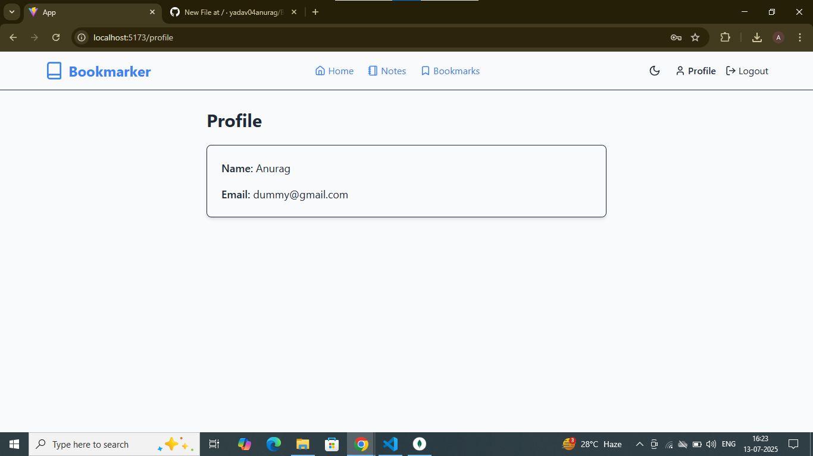
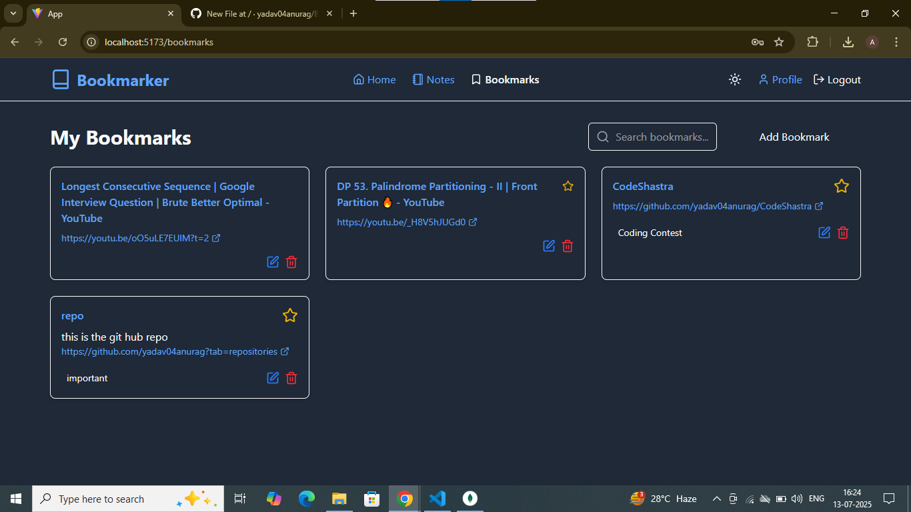
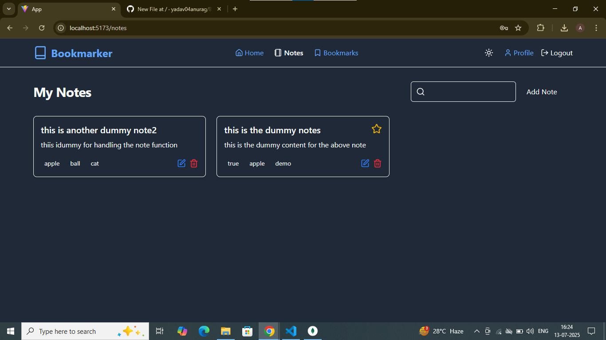

# 📚 Bookmarker - Full-Stack MERN Application

Bookmarker is a modern full-stack web application built using the **MERN stack (MongoDB, Express, React, Node.js)**. It enables users to **securely save, organize, and search** their personal notes and web bookmarks.

The frontend is developed with **Vite + React**, featuring a responsive and intuitive UI with support for dark/light modes and fast performance.

 <!-- Replace with actual screenshot -->

 <!-- Replace with actual screenshot -->

 <!-- Replace with actual screenshot -->

 <!-- Replace with actual screenshot -->

 <!-- Replace with actual screenshot -->


---

## ✨ Key Features

- 🔐 **Secure User Authentication**  
  JWT-based login and registration, with protected routes.

- 📝 **Notes Management (CRUD)**  
  Create, view, update, and delete personal notes.

- 🔖 **Bookmark Management (CRUD)**  
  Save URLs with auto-fetched titles. Edit or delete as needed.

- ⚡ **Search Functionality**  
  Instant search through notes and bookmarks by title/content.

- 🎨 **Modern UI/UX**  
  Responsive design, theme toggle, and clean navigation.

- 🚀 **Fast & Efficient**  
  Built with Vite, debounced search, and optimized API calls.

 -  ✨ Automatic Metadata Fetching**: When creating a bookmark with just a URL, the application automatically fetches the website's title, saving you time.
  -    **Powerful Search**: Instantly search through all your notes and bookmarks by title, content, or URL.
*   **Modern UI & UX**:
    *   **Responsive Design**: A seamless experience on desktop, tablet, and mobile devices.
    *   **Dark/Light Mode**: A theme toggler for user preference.
    *   **Active Link Highlighting**: Clear visual cues for navigation.
*   **Efficient & Performant**:
    *   Built with Vite for a blazing-fast frontend development experience.
    *   Debounced search functionality to prevent excessive API calls.
---

## 🧪 Demo Credentials

Use the following credentials to test the application after seeding the database:

```
Email:    dummy@gmail.com  
Password: 123456
```

---

## 🛠️ Tech Stack

### 🔧 Backend
- **Node.js** – Runtime
- **Express.js** – Web framework
- **MongoDB** – Database
- **Mongoose** – ODM
- **JWT** – Auth
- **bcrypt.js** – Password hashing
- **Zod** – Request validation
- **Cheerio & Axios** – Bookmark metadata scraping
- **dotenv** – Environment configuration

### 🎨 Frontend
- **React** – UI framework
- **Vite** – Fast dev tooling
- **React Router** – Routing
- **Tailwind CSS** – Styling
- **Lucide React** – Icon library
- **Axios** – API communication

---

## ⚙️ Getting Started

### 📋 Prerequisites
- Node.js `v18+`
- MongoDB (local or [Atlas](https://www.mongodb.com/cloud/atlas))
- npm

---

### 📦 Installation

#### 1. Clone the repository

```bash
git clone https://github.com/your-username/bookmarker.git
cd bookmarker
```

---

#### 2. Setup Backend

```bash
cd backend
npm install
```

Create a `.env` file inside `backend/`:

```env
PORT=5000
MONGO_URI=your_mongodb_connection_string
JWT_SECRET=your_strong_jwt_secret
```

---

#### 3. Setup Frontend

```bash
cd ../frontend
npm install
```

---

### ▶️ Run the Application

**Start the backend server:**

```bash
cd backend
npm start
```

Server runs at [http://localhost:5000](http://localhost:5000)

---

**Start the frontend server:**

```bash
cd frontend
npm run dev
```

App runs at [http://localhost:5173](http://localhost:5173)

---

## 🧪 Data Seeding (Important)

Seed the database with the **demo user**:

```bash
cd backend
npm run seed
```

> This will **wipe existing data** and insert:
> - Email: `dummy@gmail.com`
> - Password: `123456`

---

To destroy all data:

```bash
npm run seed:destroy
```

---

## 🗂️ Project Structure

```
/
├── backend/
│   ├── controllers/     # Request logic
│   ├── middlewares/     # Auth, error handling
│   ├── models/          # Mongoose schemas
│   ├── routes/          # API endpoints
│   ├── utils/           # Helpers and validators
│   └── server.js        # Server entry point
│
└── frontend/
    ├── src/
    │   ├── components/  # UI components
    │   ├── contexts/    # Auth and Theme providers
    │   ├── hooks/       # Custom hooks
    │   ├── pages/       # Route-based views
    │   ├── services/    # Axios API wrappers
    │   ├── App.jsx
    │   └── main.jsx
    └── vite.config.js
```

---

## 📄 License

This project is licensed under the [MIT License](./LICENSE).
